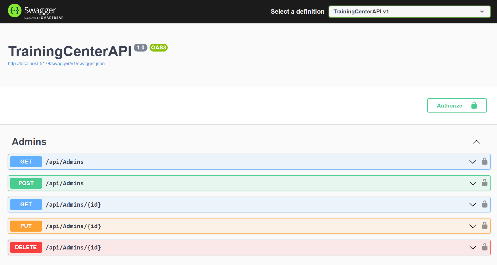
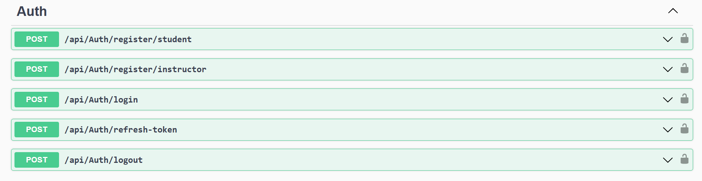
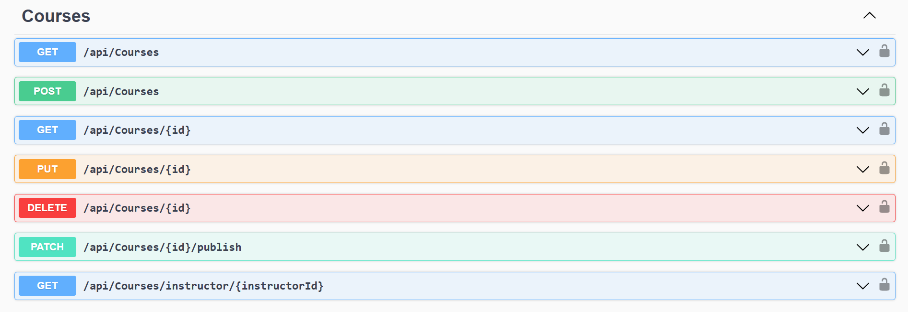
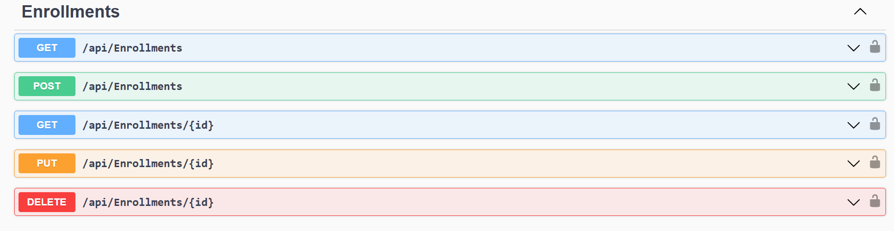
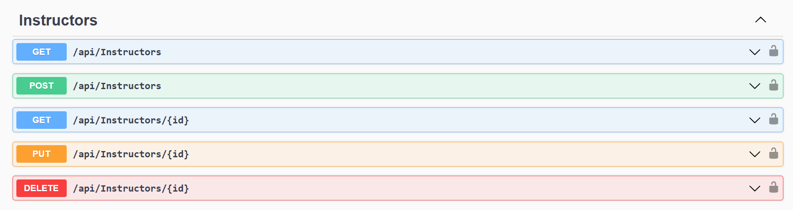
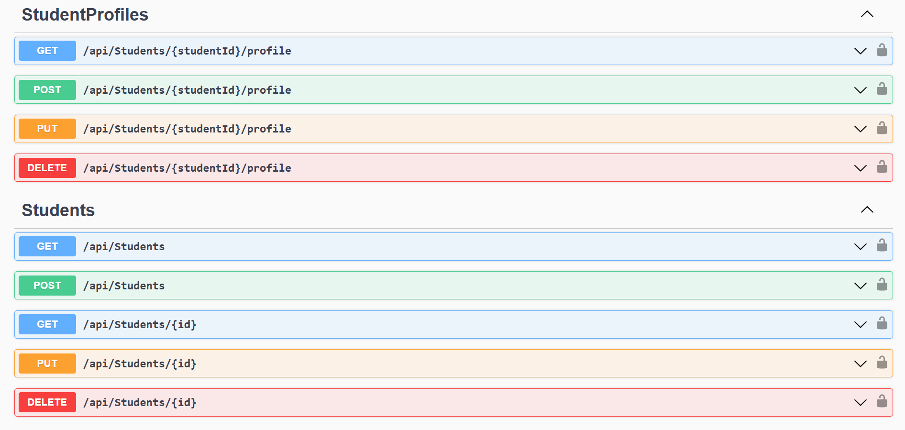

# Training Center Management System 

A RESTful backend API for managing a training center, built using **ASP.NET Core Web API (.NET 8)** with a clean layered architecture.  
The system provides secure authentication, role-based authorization, course management, and structured data access following modern backend development practices.

## 🚀 Features

### Authentication & Security
- JWT-based authentication
- Refresh token support
- Password hashing using BCrypt
- Role-based authorization
- Authorization policies
- Account security validations
- Rate limiting for authentication endpoints

### Course Management
- Create, update, delete, and retrieve courses
- Course filtering by status and level
- Pagination support
- Instructor-course relationships
- DTO-based API contracts

### Architecture & Design
- Clean layered architecture
- Repository Pattern
- Service Layer Pattern
- DTO Pattern
- Dependency Injection
- SOLID principles
- Separation of concerns

### API Features
- RESTful API design
- Swagger/OpenAPI documentation
- Global exception handling middleware
- FluentValidation for request validation
- Structured logging using Serilog
- CORS configuration
- Configuration management using Options Pattern


## 🏗️ Architecture
The project follows a layered architecture:

```
TrainingCenterAPI
│
├── Controllers
│   └── Handle HTTP requests and responses
│
├── Services
│   └── Business logic layer
│
├── Repositories
│   └── Data access abstraction
│
├── Entities
│   └── Database models
│
├── DTOs
│   └── API request and response models
│
├── Validators
│   └── FluentValidation rules
│
├── Middleware
│   └── Exception handling and request pipeline
│
└── Data
    └── Entity Framework Core DbContext
```

## 🛠️ Technologies Used

### Backend
- C#
- ASP.NET Core Web API (.NET 8)
- Entity Framework Core
- LINQ
- JWT Authentication

### Database
- SQL Server
- Entity Framework Core Code First
- Fluent API
- Database Relationships
- Migrations

### Libraries & Tools
- Swagger / OpenAPI
- FluentValidation
- BCrypt.Net
- Serilog
- Git & GitHub
- Visual Studio


## 🗄️ Database Design

The system uses a relational SQL Server database with:

- People management
- Students
- Instructors
- Courses
- Enrollments
- Refresh Tokens
- Audit Logs

Entity relationships are configured using Entity Framework Core Fluent API.


## 🔐 Authentication Flow

1. User registers an account
2. Password is securely hashed
3. User logs in using credentials
4. Server generates JWT access token
5. Refresh token is stored securely
6. Authorized requests use JWT Bearer authentication


## 📌 API Documentation

Swagger UI is available for testing and exploring endpoints.

Example:

https://localhost:{port}/swagger


## ⚙️ Installation & Setup

### Prerequisites

- .NET 8 SDK
- SQL Server
- Visual Studio 2022


### Clone Repository

git clone https://github.com/HazemAhmadHaz/TrainingCenterAPI.git
Configure Database Connection
Update the connection string inside:
appsettings.json
Example:
{
  "ConnectionStrings": {
    "DefaultConnection": "Server=.;Database=TrainingCenterDB;Trusted_Connection=True;TrustServerCertificate=True"
  }
}
Apply Database Migration
Run:
dotnet ef database update
Run Application
dotnet run

### 📂 Project Structure

```
TrainingCenterAPI
│
├── Controllers
├── DTOs
├── Entities
├── Services
├── Repositories
├── Data
├── Validators
├── Middleware
└── Program.cs
```

### 📈 Future Improvements

Possible future enhancements:
Unit testing with xUnit
Integration testing
Redis caching
API versioning
Email verification
Background jobs
Docker deployment

## 📷 Preview
<p align="center">
  
  
  
  
  
  
</p>

### 👨‍💻 Author

Hazem Ahmad
- GitHub: https://github.com/HazemAhmadHaz
- LinkedIn: https://www.linkedin.com/in/hazem-ahmad-haz
- Email: HazemAhmad01234@gmail.com
